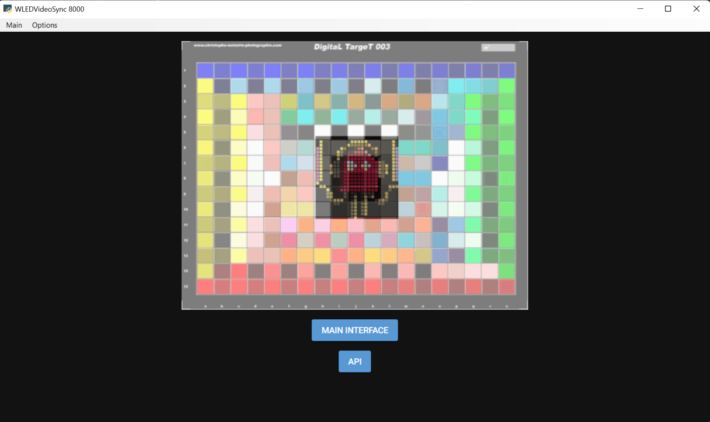
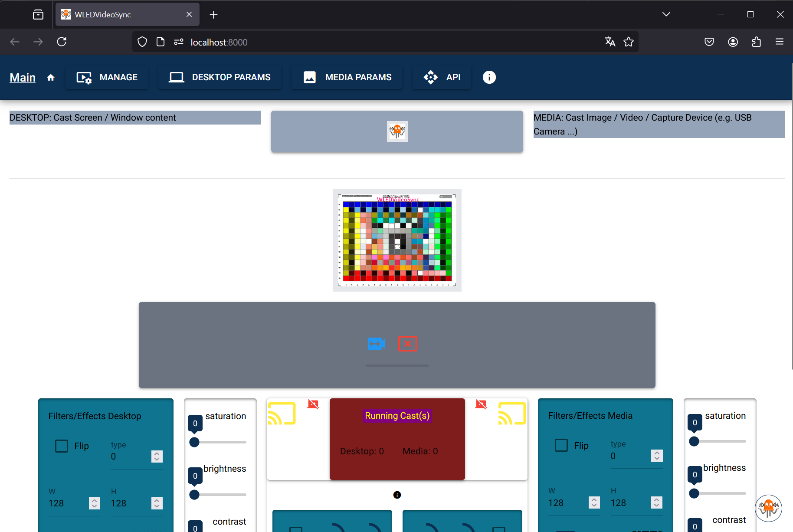

Cast video / image / desktop / window to DDP device e.g. WLED. 
Cross-Platform (Win / Linux / MacOS) Portable Application

`
19/09/2024
This is a BETA release. Tested on Win & Linux. All main features there. 
No python installation required. Can run with GUI (made with NiceGUI) or without so act as service.
Portable version give you flexibility and nothing installed into your OS.
`
## WLEDVideoSync

WLEDVideoSync is a tool designed to synchronize WLED-controlled LED strips with video content. This project enables users to create immersive lighting experiences that complement their video playback.

**Key Features:**
- Video synchronization with DDP devices e.g: WLED-controlled LED strips
- Multicast feature: aggregate multi DDP devices to a big, BIG one
- Support for various video sources: image, video or WebUrl (even Youtube)
- Support for desktop / desktop area, window content
- Customizable LED effects
- API to integrate with third party application
- Websocket for image cast if necessary
- GUI: native, browser: can be accessed remotely, or even "headless": can be used as service

**Portable Installation:**
1. Take the app from releases (Unix/ Mac/ Win)
2. --> On Mac/Linux: chmod +x WLEDVideoSync
3. Execute it to extract the standalone version
4. Go to ./WLEDVideoSync folder and run WLEDVideoSync-{OS} app.
5. --> On Mac/Linux: chmod +x WLEDVideoSync-{OS}.bin

**Manual Installation:**
1. Clone the repository from GitHub
2. Install required dependencies : pip install -r requirements.txt
3. --> on Mac/linux : pip3 install -r requirements.txt
4. Run it with : python -m WLEDVideoSync
5. --> on Mac/linux : python3 -m WLEDVideoSync

**Usage:**
1. Connect your WLED-controlled LED strips
2. Launch the WLEDVideoSync application
3. Select your video source
4. Configure LED mapping and effects
5. Start the synchronization

**Configuration Options:**
- LED strip layout, 2D Matrix
- Color mapping
- Effect intensity
- Synchronization delay

**Troubleshooting:**
- Ensure your WLED device is properly connected and configured
- Check network connectivity between the application and WLED
- For optimal performance, be sure to be on the same VLAN as your DDP devices
- Verify video source compatibility
- On linux, wayland do not work, use X11

**Contributing:**
Contributions to the project are welcome. Please follow the standard GitHub fork and pull request workflow.

**License:**
MIT

## USER Guide

### Installation

- Download the corresponding release to your OS : [Get software](https://github.com/zak-45/WLEDVideoSync/releases).
  - Double-click on it to extract WLEDVideoSync folder
- Go into and click on `WLEDVideoSync-{OS}`(exe/bin) to execute the main program.
  - If you are on Win system, this should open native windows

   - On Mac/Linux, you should see the app into your default browser

