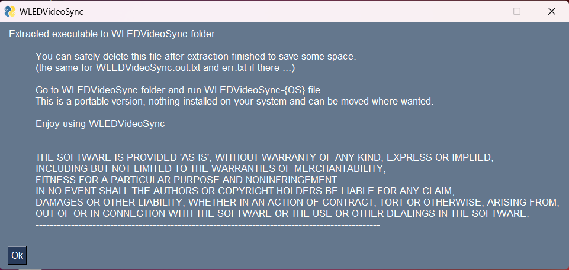
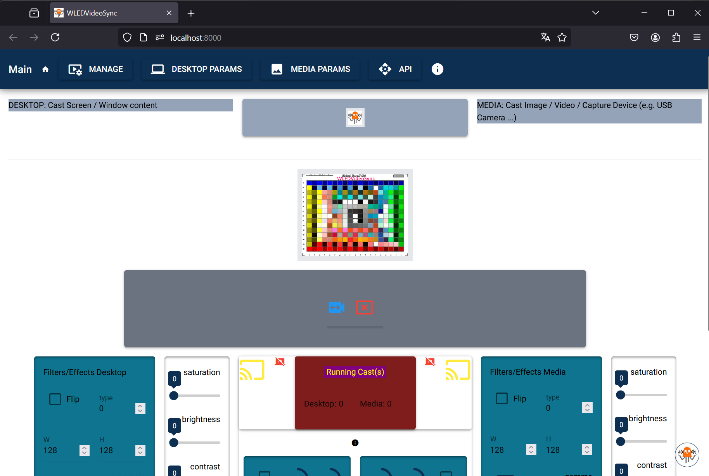
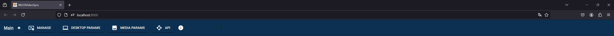
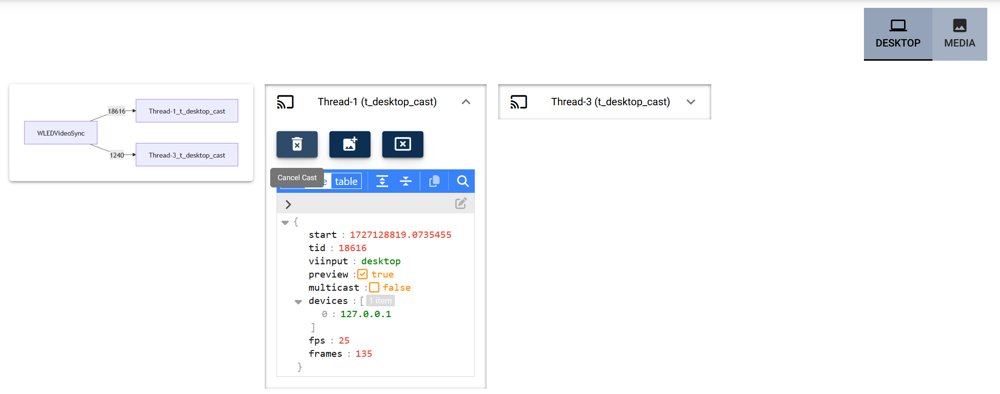
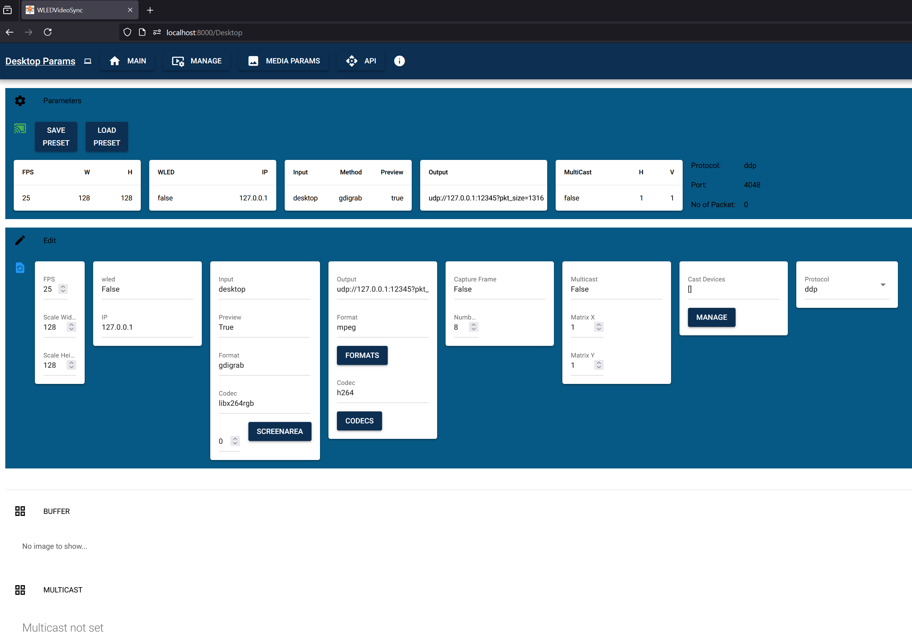
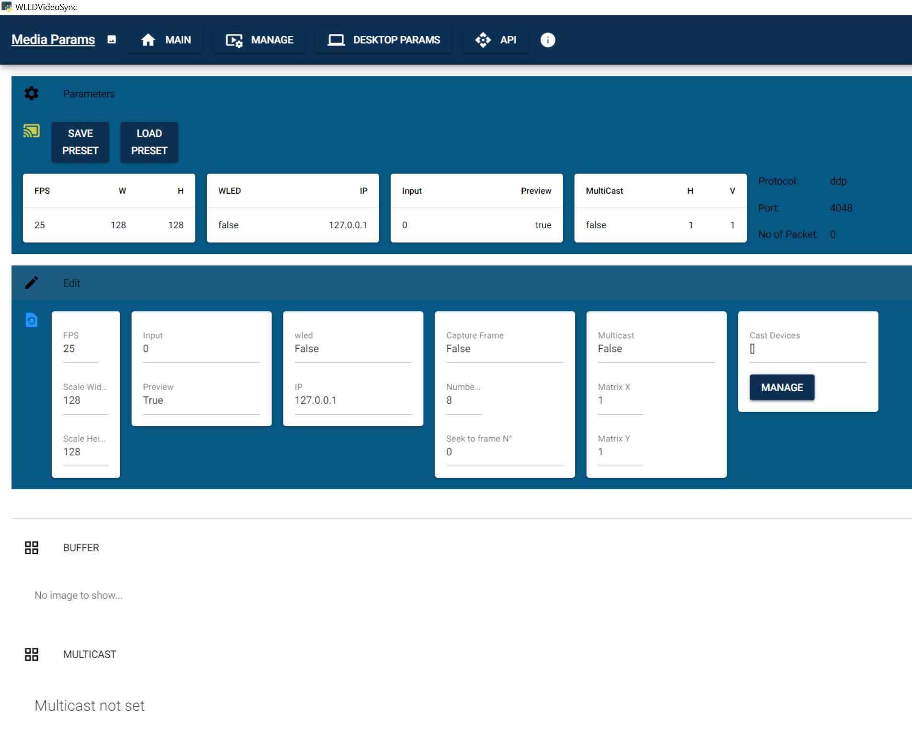
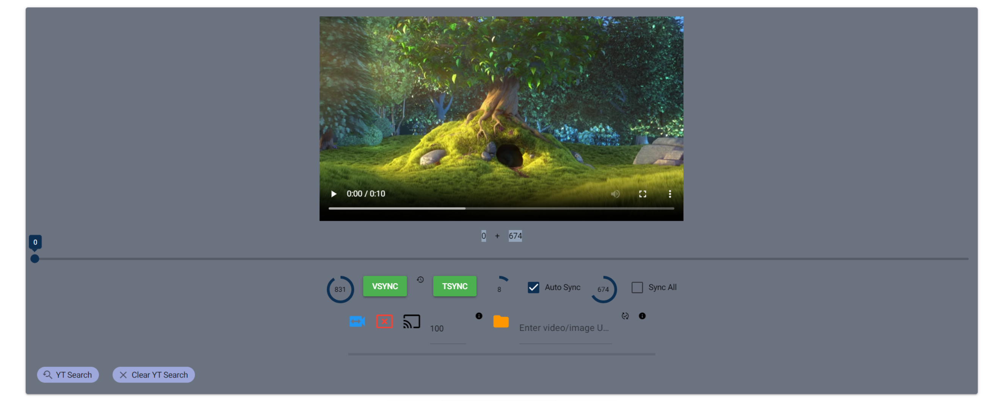
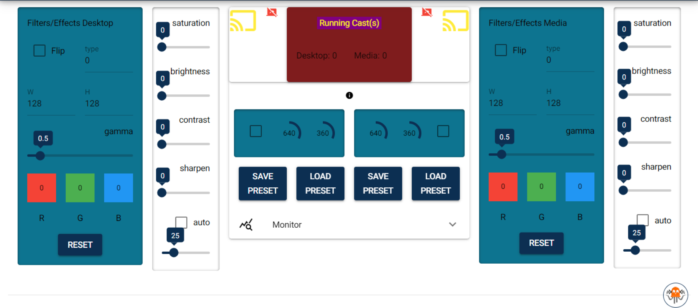

<div align=center>Cast video / image / desktop / window to e131/artNet/DDP device e.g. WLED.<br>
Cross-Platform (Win / Linux / macOS) Portable Application
</div>

`
19/09/2024
This is a BETA release. Tested on Win (11) & Linux (ubuntu 24.04). All main features there. 
No python installation required. Can run with GUI (made with NiceGUI) or without so act as service.
Portable version give you flexibility and nothing installed into your OS.
`
## WLEDVideoSync

WLEDVideoSync is a tool designed to synchronize Net LED strips with video content. This project enables users to create immersive lighting experiences that complement their video playback.

**Key Features:**
- Video synchronization with e131 / artNet / DDP devices e.g: WLED-controlled LED strips
- Multicast feature: aggregate multi DDP devices to a big, BIG one
- Support for various video sources: image, video or WebUrl (even Youtube)
- Support for desktop / desktop area, window content
- Customizable LED effects
- API to integrate with third party application
- Websocket for image cast if necessary
- GUI: native, browser: can be accessed remotely, or even "headless": can be used as service

**Portable Installation:**
1. Unix / Win : Take the app from releases      
   1. --> On Linux: chmod +x WLEDVideoSync-Linux_x86_64
   2. Execute it to extract the standalone version
   3. Go to ./WLEDVideoSync folder and run WLEDVideoSync-{OS} app.
   

2. MacOS : Take the zip 'tar/gz' from releases (arm or x86)
   1. double click to extract the app bundle
      1. --> open terminal, go to Downloads/WLEDVideoSync
      2. --> enter this command to remove the extra attribute (replace by arm if this your PC architecture)
      ````
      xattr -d com.apple.quarantine WLEDVideoSync-macOS_x86_64.app 
   2. double-click on WLEDVideoSync-macOS(arm or x86).app

**Manual Installation:**
1. Clone the repository from GitHub
2. Install required dependencies : pip install -r requirements.txt
3. --> on Mac/linux : pip3 install -r requirements.txt
4. Run it with : python -m WLEDVideoSync
5. --> on Mac/linux : python3 -m WLEDVideoSync

**Usage:**
1. Connect your WLED-controlled LED strips
2. Launch the WLEDVideoSync application
3. Select your video source
4. Configure LED mapping and effects
5. Start the synchronization

**Configuration Options:**
- LED strip layout, 2D Matrix
- Color mapping
- Effect intensity
- Synchronization delay

**Troubleshooting:**
- Ensure your WLED device is properly connected and configured
- Check network connectivity between the application and WLED
- For optimal performance, be sure to be on the same VLAN as your DDP devices
- Verify video source compatibility
- On linux, wayland do not work, use X11
- On Mac/Linux be sure to set +x on WLEDVideoSync app

**Contributing:**
Contributions to the project are welcome. Please follow the standard GitHub fork and pull request workflow.

**License:**
MIT


## USER Guide

### Installation

- Download the corresponding release to your OS : [Get software](https://github.com/zak-45/WLEDVideoSync/releases)
  -(Mac/Linux set +x on WLEDVideoSync app) 
    - Double-click on it to extract WLEDVideoSync folder
    - Once extraction finished, you should see this screen:
  

        ``WLEDVideoSync folder can be copied, moved where you want, so keep organized``
  

- Go into and click on `WLEDVideoSync-{OS}`(exe/bin) to execute the main program.
  - If you are on Win system, this should open "native" windows


   - On Mac/Linux, you should see the app into your default browser




All of this could be configured later, for the moment focus on default.


### MAIN Interface

#### Header MENU



- MANAGE:
  - Screen to manage running DESKTOP / MEDIA Casts. From here you will be able to see all running casts spilt by type.


     
    - available actions:  Cancel cast, to stop this cast
                          Snapshot, take a picture from running cast. Image will be stored into cast BUFFER
                          Stop Preview, close preview window
                          Start Preview, open preview window
                          Change IP address, stream to a different DDP device and if set to 127.0.0.1: suspend stream
                          Multicast effects, modify cast devices order in circular, reverse or random way

- DESKTOP PARAMS:
  - Manage DESKTOP parameters. Screen to manage DESKTOP parameters, see images into BUFFER and MULTICAST information.



    - Params info:
    
        FPS: enter frame per second desired for the cast stream
        Scale width: cast x size in pixels  
        Scale height: cast y size in pixels
          These values should match Matrix 2D settings of your DDP device 
        
        wled: True or False, if true the DDP device act as WLED and app will try to retreive x,y values from it.
        IP: ip address of the DDP device

        Input: input type to cast
            To cast entire desktop:
                'desktop': for Win OS
                ':0' or ':0.0' or other ... for Linux (should be the DISPLAY env)
            To cast only an area:
                'area' --> see SCREENAREA
            To cast a specific window content:
                'win=xxxxxxxxx'  where xxxxxx should be for Win the window title and for Linux window ID/or window title
        Preview: True or False, if True a cast preview window will be displayed
        Format: 'gdigrab' for Win and 'x11grab' for Linux when want to cast Window/Desktop
        Codec: PyAV codec used, let it to 'libx264rgb' for now
        Screenarea / monitor number: select monitor number and click to SCREENAREA button to make area selection
        
        Output: give file name or rtsp, udp etc ... to stream input. For future use.-->*Protocol
        format: Pyav format
        Codec: Pyav codec 

        Capture Frame: True or False, True will capture frames from input
        Number: number of frames to capture, frames will be stored under BUFFER
        
        Multicast: True or False, if True and Matrix (x,y) = 1 then cast will stream to all IP into 'Cast Devices'
                   for Matrix <> 1, this will split the cast stream into multiple images to create a Big virtual Matrix
                   All DDP devices need to have the same 2D Matrix configuration                
        Matrix X: number of DDP devices on X axis
        Matrix Y: number of DDP devices on Y axis
                      e.g. WLED matrix 16x16 : 3(x) x 2(y)                    
                      ==> this require 6 devices to set into 'Cast Devices' list                         
                          (tuple of: device index(0...n) , IP address) 
                          This will create 6 images to send and provide big image of 3x16 leds for x and 2x16 for y

        Cast Devices: number and IP address of each DDP device. Number not yet managed
                      device order come from entry order 
        
        Protocol: e131 / artNet / ddp or other, if 'other' will use the 'Output' entry, let it to ddp for now

``Main of these values can be saved into Preset to be reloaded``

- MEDIA PARAMS:
  - Manage MEDIA parameters: Screen to manage MEDIA parameters, see images into BUFFER and MULTICAST information.



    - Params info:
    
        FPS: enter frame per second desired for the cast stream
        Scale width: cast x size in pixels  
        Scale height: cast y size in pixels
          These values should match Matrix 2D settings of your DDP device 

        Input: input type to cast
               - 0, 1 or ...: this will cast your capture device number (e.g: USB Webcam)
               - enter full path of any of your media files, image or video
        Preview: True or False, if True a cast preview window will be displayed
 
        wled: True or False, if true the DDP device act as WLED and app will try to retreive x,y values from it.
        IP: ip address of the DDP device

        Capture Frame: True or False, True will capture frames from input
        Number: number of frames to capture, frames will be stored under BUFFER
        Seek to Frame N: start read at this position, do not work for real time media.
        
        Multicast: True or False, if True and Matrix (x,y) = 1 then cast will stream to all IP into 'Cast Devices'
                   for Matrix <> 1, this will split the cast stream into multiple images to create a Big virtual Matrix
                   All DDP devices need to have the same 2D Matrix configuration                
        Matrix X: number of DDP devices on X axis
        Matrix Y: number of DDP devices on Y axis
                      e.g. WLED matrix 16x16 : 3(x) x 2(y)                    
                      ==> this require 6 devices to set into 'Cast Devices' list                         
                          (tuple of: device index(0...n) , IP address) 
                          This will create 6 images to send and provide big image of 3x16 leds for x and 2x16 for y

        Protocol: e131 / artNet / ddp or other,  let it to ddp for now

        Cast Devices: number and IP address of each DDP device. Number not yet managed
                      device order come from entry order 

``Main of these values can be saved into Preset to be reloaded``


- API: Redirect to API docs/endpoint.


#### Video Player


- Video Player: provide some additional features to MEDIA casts
  - Video Preview
  - Additional Time Slider
  - Back/Forward some frames
  - VSYNC: sync cast(s) to video player time: video timer
  - TSYNC: sync cast(s) to time slider: slider timer
  - Delay before AUTO SYNC: seconds 
  - AUTO SYNC: Cast will automatically sync to the last timer selected (Player or Slider)
      - if more than one cast, that's the first one that take the information, totally random
      - if timer come from Slider, this will make a loop of n seconds (previous param)
      - if timer come from Player and the player is set to Pause, this will make a loop of n seconds (previous param)
      - if timer come from Player and the player continue, this will make automatic sync every n seconds (previous param)
  - Add Delay in ms: additional time to add to All Sync action
  - Sync All: if more than one cast, this will sync them to the selected timer
  - Play/Cast: if video format managed by the player, this will initiate on same time, play and cast, otherwise only cast
  - Re-cast: number of additional time you want to cast the MEDIA, -1 for infinite, max 9999
  - Url/Path field: enter local media name or WebUrl link, even YouTube
  - Download Icon: click on it to initiate required action depend on previous Url/Path entry
    - if local path, this will set the player to it (video/image)
    
          player had limited codec capacity, preview could not work but cast yes
    
    - if video WebUrl, try to directly manage it by the player
    - if YouTube, this will download the video and put it into the app media/ folder
    - if this is an image, this will download it and put it into the app media/ folder
      
          if you want to keep downloaded video/image see configuration file
    
  - YT Search: click on it to open YouTube search area, more than one possible
    - just enter some keywords to search for
    - once result displayed clicked on the link provided to copy it so you can paste into Url/Path field
  - Clear YT Search: will clear all YT Search area


#### Filters/Effects


- DESKTOP or MEDIA, this work on the same way, got different parameters to set and apply to the casts for custom effects
  - Flip: when checked this will flip the image depend on the type value (right/left, top/bottom)
  - W / H:  pixel_art width in pixels /  pixel_art height in pixels, init to the same as for DESKTOP/MEDIA PARAMS.
    - you can change them, preview image will adapt pixel art to this new size but cast remain the same
  - gamma: change gamma value
  -  R G B : adjust Red/Green/Blue Colors
  - saturation / brightness / contrast / sharpen : self-explanatory
  - auto: when checked, this will auto adapt brightness/contrast depend on slider
  - Cast Icon: Yellow, cast not allowed, Green, allowed, Red, running
      - when yellow and click on it, will allow cast
  - Red Icon: stop all running casts

``On preview window, you will see effects in real time``
``All of these values can be saved into Preset to be reloaded``

### Configuration
The main App configuration file is: ``WLEDVideoSync/config/WLEDVideoSync.ini``
See ``WLEDVideoSync/config/WLEDVideoSync.readme`` for in-deep information.


The logging configuration file is : ``WLEDVideoSync/config/logging.ini``. Logs can be found under ``log/`` folder.

Default behaviour:
  - Win OS: app will start on "native" windows mode with a 'selection' window and uvicorn server on different process.
    - Closing App will put it on 'systray', terminate it need to be done from : ``Exit - server:xxx``
  
- Mac/Linux: app will start on 'default' browser, no systray options.
    -  use SHUTDOWN in footer to stop application
    - "native" mode has not been deeply tested on these platforms, so may provide some trouble.
    

### WebSocket
endpoint : ``/ws`` e.g: 127.0.0.1:8000/ws

``/ws/docs`` : some online documentation

Websocket has been implemented mainly to cast only image & small delay. The image need to be stored into BUFFER.
Communication data use Json format for in / out. 

action/type/param are required keys.
e.g: ``{"action":{"type":"cast_image", "param":{"image_number":0,"device_number":-1, "class_name":"Media"}}}``
