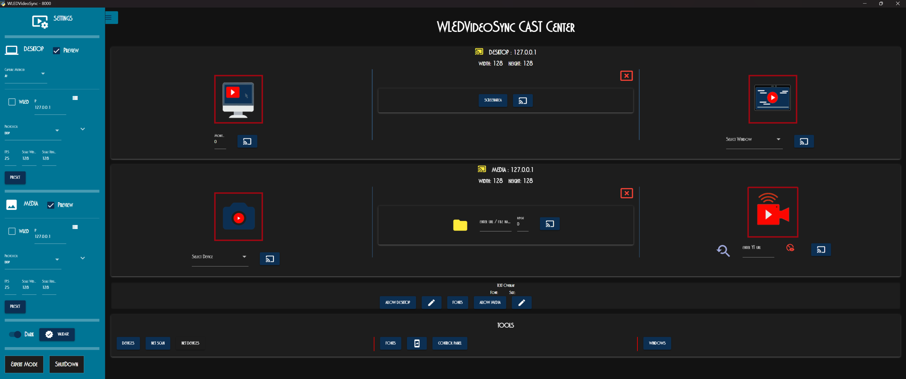
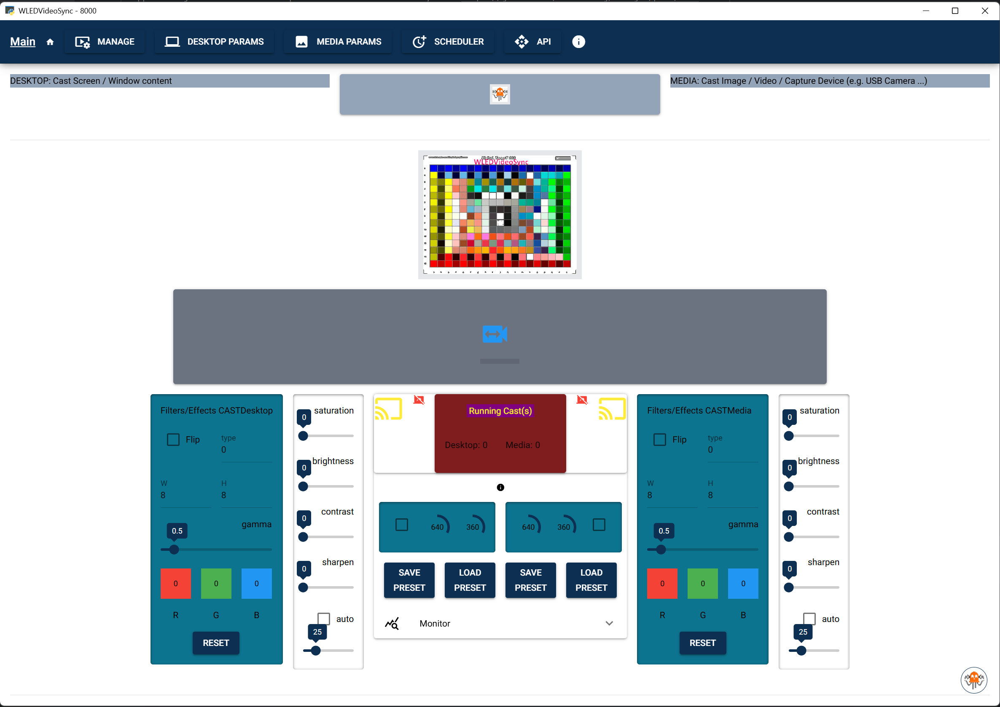
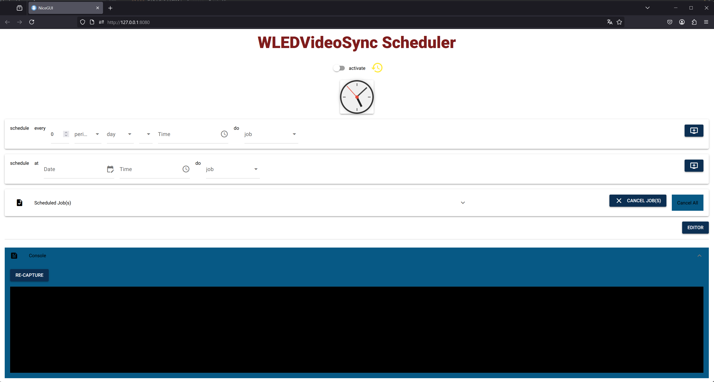
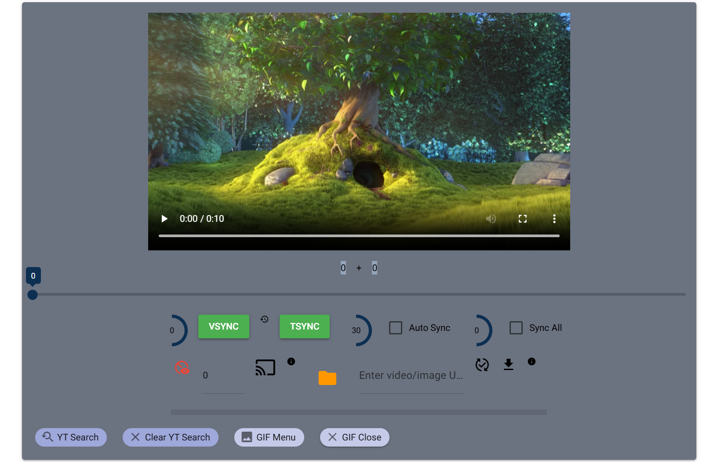
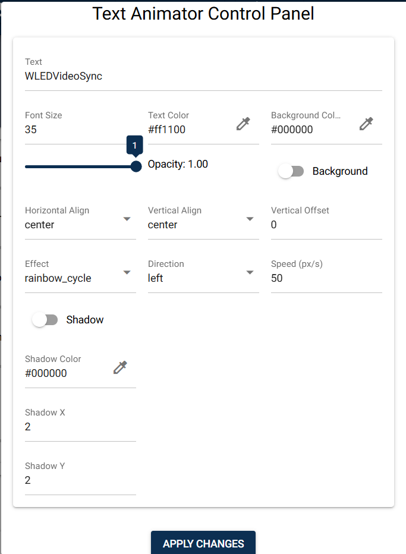
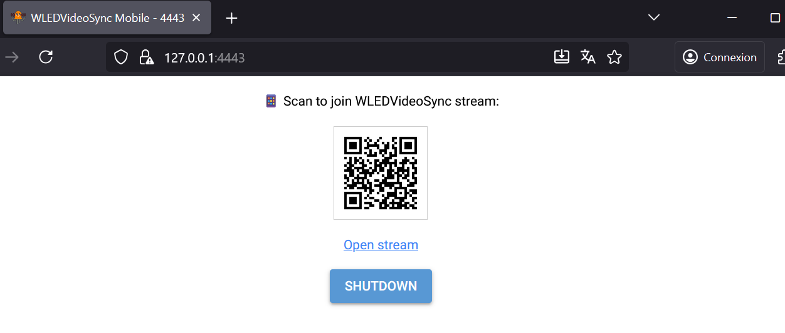
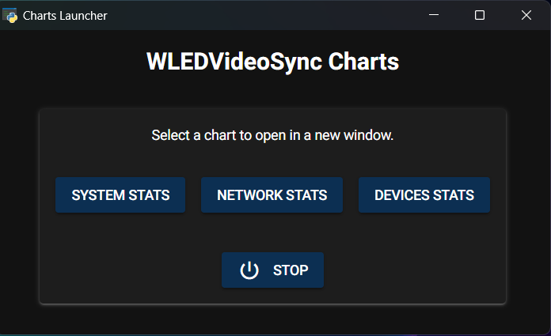
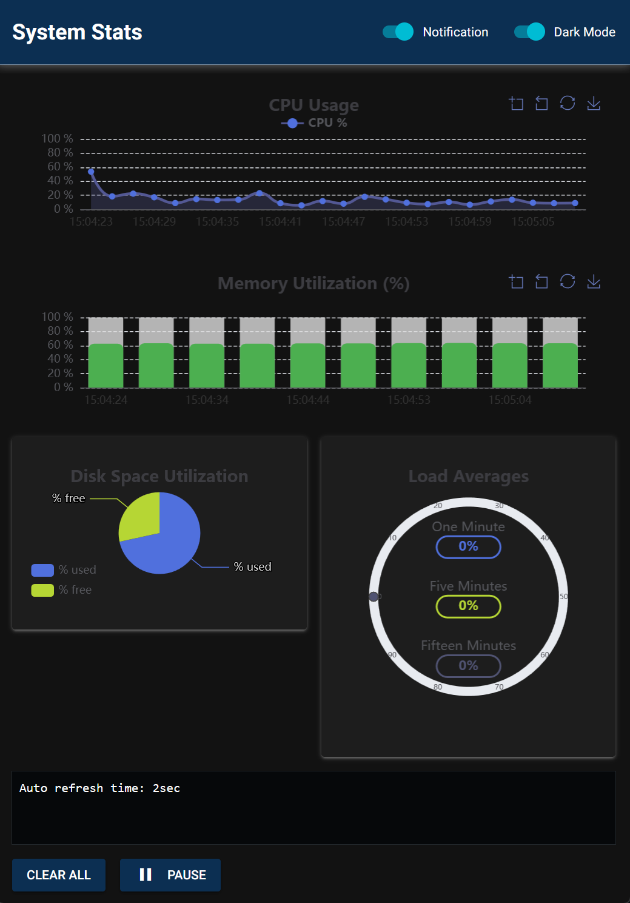
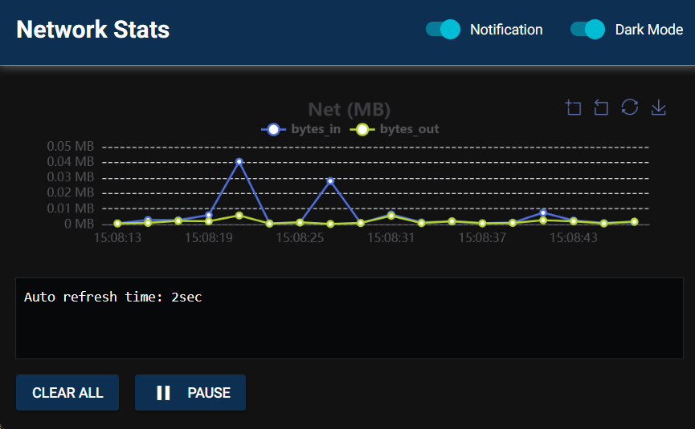
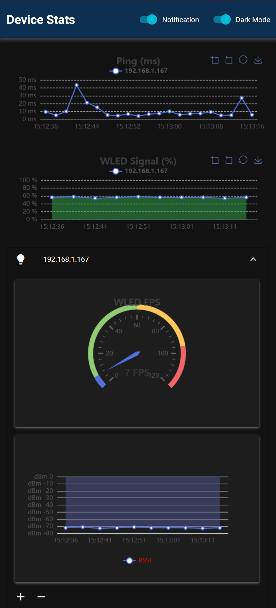

<div align="center">
 
 # WLEDVideoSync
 
 ### Cast video, images, or your screen to e131/artNet/DDP devices like WLED.
 **A Cross-Platform (Windows / Linux / macOS) Portable Application.**
 
 [](https://opensource.org/licenses/MIT)

</div>

---


 
 ## Key Features
 - **Versatile Streaming**: Stream to e131, Art-Net, and DDP devices, including WLED.
 - **Multicast Support**: Aggregate multiple devices into one large virtual matrix.
 - **Multiple Sources**: Cast your desktop, a specific window, a screen area, images, videos, web URLs, and even YouTube content.
 - **Mobile Camera / Media Streaming**: Use your phone as a wireless webcam / media source via a simple QR code scan (no third-party app needed).
 - **Text Overlays**: Add custom text with multiple effects, fonts, and animations.
 - **Powerful UI**: A modern web interface built with NiceGUI that can run as a native window, in a browser, or headlessly as a service.
 - **GIF Creation**: Create GIFs from video segments and upload them directly to a WLED device, complete with a new preset.
 - **Full-Featured Scheduler**: Automate your casts with recurring, one-shot, or custom-timed jobs.
 - **Coldtype Integration**: a powerful Python library for typographic and graphic animation.
 - **Advanced Scripting**: Extend functionality with a built-in Python editor and an external API for third-party integration.
 
 ---
 
 ## Installation
 
 ### Portable (Recommended)
 1.  **Download**: Grab the latest release for your OS from the **Releases Page**.
 2.  **Extract**:
     -   **Windows/Linux**: Run the downloaded executable. It will extract a `WLEDVideoSync` folder.
     -   **macOS**: Double-click the downloaded `.zip` or `.tar.gz` file to extract the `.app` bundle.
 3.  **Run**:
     -   **Windows/Linux**: Open the extracted `WLEDVideoSync` folder and run the `WLEDVideoSync-{OS}` executable.
     -   **macOS**: Before running, you must remove the quarantine attribute. Open a terminal and run:
         ```bash
         # Navigate to the folder where the app was extracted, e.g., Downloads
         cd ~/Downloads
         # Remove the attribute (replace x86_64 with arm64 if you have an Apple Silicon Mac)
         xattr -d com.apple.quarantine WLEDVideoSync-macOS_x86_64.app
         ```
         Afterward, you can double-click the `WLEDVideoSync-macOS...app` to run it.
 
 ### From Source (Manual)
 1.  **Clone Repository**: `git clone https://github.com/zak-45/WLEDVideoSync.git`
 2.  **Install Dependencies**: `pip install -r requirements.txt` (or `pip3` on macOS/Linux).
 3.  **Run Application**: `python WLEDVideoSync.py` (or `python3` on macOS/Linux).
 
 ---
 
  
 ## Quick Start
 
 1.  **Launch the Application**: Start WLEDVideoSync.
 2.  **Open Settings**: In the left-side menu, click on **Desktop Params** or **Media Params**.
 3.  **Configure Your Device**:
     -   Enter your WLED device's IP address in the **IP** field.
     -   Check the **WLED** box to automatically detect the matrix size, or enter the **Width** and **Height** manually.
 4.  **Start Casting**:
     -   Go to the **Cast Center** (main page).
     -   Click the large **Cast Icon** for either Desktop or Media to start streaming!
 
 ---
 
 ## User Guide

### Installation

- Download the corresponding release to your OS : [Get software](https://github.com/zak-45/WLEDVideoSync/releases)
  -(Mac/Linux set +x on WLEDVideoSync app) 
    - Double-click on it to extract WLEDVideoSync folder
    - Once extraction finished, you should see this screen:
  

   > `WLEDVideoSync` folder can be copied and moved where you want, so keep organized.
   
  

- Go into and click on `WLEDVideoSync-{OS}`(exe/bin) to execute the main program.
  - If you are on Win/Mac system, this should open "native" windows



   - On Linux, you should see the app into your default browser


All of this could be configured later, for the moment focus on default.


### MAIN Interface

#### Header MENU


- MANAGE:
  - Screen to manage running DESKTOP / MEDIA Casts. From here you will be able to see all running casts spilt by type.


     
    - available actions:  Cancel cast, to stop this cast
                          Snapshot, take a picture from running cast. Image will be stored into cast BUFFER
                          Stop Preview, close preview window
                          Start Preview, open preview window
                          Change IP address, stream to a different DDP device and if set to 127.0.0.1: suspend stream
                          Multicast effects, modify cast devices order in circular, reverse or random way

- DESKTOP PARAMS:
  - Manage DESKTOP parameters. Screen to manage DESKTOP parameters, see images into BUFFER and MULTICAST information.


     - **Params Info**:
    
        FPS: enter frame per second desired for the cast stream
        Scale width: cast x size in pixels  
        Scale height: cast y size in pixels
          These values should match Matrix 2D settings of your DDP device 
        
        wled: True or False, if true the DDP device act as WLED and app will try to retreive x,y values from it.
        IP: ip address of the DDP device

        Capture Methode: av or mss, av is the preferred one but mss should be necessary for macOS
                          mss do not run in wayland (linux)

        Input: input type to cast
            To cast entire desktop:
                'desktop': for Win OS
                ':0' or ':0.0' or other ... for Linux (should be the DISPLAY env)
            To cast only an area:
                'area' --> see SCREENAREA
            To cast a specific window content:
                'win=xxxxxxxxx'  where xxxxxx should be for Win the window title and for Linux window ID/or window title
            To cast from a 'queue':
                select 'queue', this will open a preview window with default image and waiting to receive images 
                from other processes (e.g: text animation ...)
        Preview: True or False, if True a cast preview window will be displayed
        Format: 'gdigrab' for Win and 'x11grab' for Linux when want to cast Window/Desktop using av methode
        Codec: PyAV codec used, let it to 'libx264rgb' for now
        Screenarea / monitor number: select monitor number and click to SCREENAREA button to make area selection
                                    (has some trouble on macOS)
        Output: give file name or rtsp, udp etc ... to stream input. For future use.-->*Protocol
        format: Pyav format
        Codec: Pyav codec 

        Capture Frame: True or False, True will capture frames from input
        Number: number of frames to capture, frames will be stored under BUFFER
        
        Multicast: True or False, if True and Matrix (x,y) = 1 then cast will stream to all IP into 'Cast Devices'
                   for Matrix <> 1, this will split the cast stream into multiple images to create a Big virtual Matrix
                   All DDP devices need to have the same 2D Matrix configuration                
        Matrix X: number of DDP devices on X axis
        Matrix Y: number of DDP devices on Y axis
                      e.g. WLED matrix 16x16 : 3(x) x 2(y)                    
                      ==> this require 6 devices to set into 'Cast Devices' list                         
                          (tuple of: device index(0...n) , IP address) 
                          This will create 6 images to send and provide big image of 3x16 leds for x and 2x16 for y

        Cast Devices: number and IP address of each DDP device. Number not yet managed
                      device order come from entry order 
        
        Protocol: e131 / artNet / ddp or other, if 'other' will use the 'Output' entry, let it to ddp for now

``Main of these values can be saved into Preset to be reloaded``

- MEDIA PARAMS:
  - Manage MEDIA parameters: Screen to manage MEDIA parameters, see images into BUFFER and MULTICAST information.


    - Params info:
    
        FPS: enter frame per second desired for the cast stream
        Scale width: cast x size in pixels  
        Scale height: cast y size in pixels
          These values should match Matrix 2D settings of your DDP device 

        Input: input type to cast
               - 0, 1 or ...: this will cast your capture device number (e.g: USB Webcam)
               - enter full path of any of your media files, image or video
        Preview: True or False, if True a cast preview window will be displayed
 
        wled: True or False, if true the DDP device act as WLED and app will try to retreive x,y values from it.
        IP: ip address of the DDP device

        Capture Frame: True or False, True will capture frames from input
        Number: number of frames to capture, frames will be stored under BUFFER
        Seek to Frame N: start read at this position, do not work for real time media.
        
        Multicast: True or False, if True and Matrix (x,y) = 1 then cast will stream to all IP into 'Cast Devices'
                   for Matrix <> 1, this will split the cast stream into multiple images to create a Big virtual Matrix
                   All DDP devices need to have the same 2D Matrix configuration                
        Matrix X: number of DDP devices on X axis
        Matrix Y: number of DDP devices on Y axis
                      e.g. WLED matrix 16x16 : 3(x) x 2(y)                    
                      ==> this require 6 devices to set into 'Cast Devices' list                         
                          (tuple of: device index(0...n) , IP address) 
                          This will create 6 images to send and provide big image of 3x16 leds for x and 2x16 for y

        Protocol: e131 / artNet / ddp or other,  let it to ddp for now

        Cast Devices: number and IP address of each DDP device. Number not yet managed
                      device order come from entry order 

``Main of these values can be saved into Preset to be reloaded``

- SCHEDULER: Manage & Schedule Jobs.
    > The Scheduler allows you to automate almost any task within WLEDVideoSync. A "job" is simply a Python function that you can schedule to run at specific times or intervals. This is incredibly powerful for creating automated light shows, starting/stopping casts, or interacting with other parts of the application programmatically.



  **How It Works:**
  - **Jobs are Python Functions**: Any Python function you write in the `xtra/jobs/` directory becomes a job you can schedule.
  - **Full Scripting Power**: Because jobs are Python code, you can import and use other parts of the application, like the `Desktop` and `Media` objects, to control casts directly.
  - **Flexible Scheduling**:
    - **Recurring Jobs**: Use the "Every" dropdowns to set up jobs that run repeatedly (e.g., every 10 minutes, every Monday at 9:00 AM).
    - **One-Time Jobs**: Use the "At a specific date/time" section to schedule a job to run only once.
    - **Custom Schedules**: For advanced users, you can enter a custom `schedule` module string.
  - **Manage Scheduled Tasks**: The table at the bottom shows all currently scheduled tasks. You can view their next run time and delete them.

  **Creating a Custom Job:**
  1.  Navigate to the **PYEditor** from the footer menu.
  2.  Create a new file or open an existing one in the `xtra/jobs/` folder 
> WLEDVideoSync use xtra/jobs/WLEDJobs.py --> you got direct access from Scheduler page
  3.  Write your Python function. You can pass arguments to your function from the "Args" field in the Scheduler UI.
  4.  Save the file.
  5.  Go back to the Scheduler page and click the "Refresh" button to see your new job in the dropdown list.

  **Example Job:**
  Here is a simple job that stops all running casts. You could save this as `xtra/jobs/my_custom_jobs.py`.

  ```python
  # In a file like xtra/jobs/my_custom_jobs.py
from mainapp import Desktop, Media
  
def stop_all_casts():
      """A simple job to stop all running casts."""
      print("Executing job: stop_all_casts")
      Desktop.stopcast = True
      Media.stopcast = True
  ```
  
  > For more advanced scheduling options, refer to the official schedule library documentation.
  

#### Video Player


- Video Player: provide some additional features to MEDIA casts
  - Video Preview
  - Additional Time Slider
  - Back/Forward some frames
  - VSYNC: sync cast(s) to video player time: video timer
  - TSYNC: sync cast(s) to time slider: slider timer
  - Delay before AUTO SYNC: seconds 
  - AUTO SYNC: Cast will automatically sync to the last timer selected (Player or Slider)
      - if more than one cast, that's the first one that take the information, totally random
      - if timer come from Slider, this will make a loop of n seconds (previous param)
      - if timer come from Player and the player is set to Pause, this will make a loop of n seconds (previous param)
      - if timer come from Player and the player continue, this will make automatic sync every n seconds (previous param)
  - Add Delay in ms: additional time to add to All Sync action
  - Sync All: if more than one cast, this will sync them to the selected timer
  - Play/Cast: if video format managed by the player, this will initiate on same time, play and cast, otherwise only cast
  - Re-cast: number of additional time you want to cast the MEDIA, -1 for infinite, max 9999
  - Url/Path field: enter local media name or WebUrl link, even YouTube
  - Stream Icon: click on it for direct stream from url/path
  - Download Icon: click on it to save Url/Path entry locally (Yt / image)
    - if this is a YouTube, this will download the video and put it into the app media/ folder
    - if this is an image, this will download it and put it into the app media/ folder

    - if local path, this will set the player to it (video/image)
    
    >player had limited codec capacity, preview could not work but cast yes
    
    - if video WebUrl, try to directly manage it by the player
      
    > if you want to keep downloaded video/image see configuration file
    
  - YT Search: click on it to open YouTube search area, more than one possible
    - just enter some keywords to search for
    - once result displayed clicked on the link provided to copy it into the Url/Path field / Clipboard
  - Clear YT Search: will clear all YT Search area
  
  - **GIF Menu**: 
    - WLEDVideoSync includes a powerful tool to create animated GIFs from video clips and upload them directly to a WLED device. This allows you to create custom, short animations that can be played offline on your WLED setup.
      - you can create a new GIF from the selected video (with start / end frame selection)
      
    - **How to Use:**
        1.  **Load a Video**: Select a local video file or use a YouTube URL.
        2.  **Open the GIF Menu**: Click the **"GIF Menu"** button to open the GIF creation tools.
        3.  **Create Your GIF**:
               - Use the sliders or input fields to select the **Start Frame** and **End Frame** for your animation.
               - Click **"Create GIF"**. The application will process the video segment and generate the GIF.
        4.  **Upload to WLED**:
               - If your target `Media` device is a WLED, a **"Push to WLED"** button will appear.
               - Clicking this will upload the GIF to the WLED device's internal storage and automatically create a new preset for it, making it easy to trigger from the WLED interface.         
               - You can also run the GIFPLAYER
                 - Thanks to : https://github.com/Manut38/WLED-GifPlayer-UI
                     
    - GIF Close: close the GIF Menu and restore player one.

  
#### Filters/Effects Control Panel


- DESKTOP or MEDIA, this work on the same way, got different parameters to set and apply to the casts for custom effects
  - Flip: when checked this will flip the image depend on the type value (right/left, top/bottom)
  - W / H:  pixel_art width in pixels /  pixel_art height in pixels, init to the same as for DESKTOP/MEDIA PARAMS.
    - you can change them, preview image will adapt pixel art to this new size but cast remain the same
  - gamma: change gamma value
  -  R G B : adjust Red/Green/Blue Colors
  - saturation / brightness / contrast / sharpen : self-explanatory
  - auto: when checked, this will auto adapt brightness/contrast depend on slider
  - Cast Icon: Yellow, cast not allowed, Green, allowed, Red, running
      - when yellow and click on it, will allow cast
  - Red Icon: stop all running casts

``On preview window, you will see effects in real time``
 ``All of these values can be saved into a Preset to be reloaded``
 
#### Text Overlay Control Panel
WLEDVideoSync allows you to overlay dynamic, animated text on top of your casts. This control panel is your starting point for managing all text-related settings.


**Main Controls:**
- **Allow Desktop / Allow Media**: These buttons act as master switches to enable or disable the text overlay for all `Desktop` or `Media` casts, respectively. The button will be green when enabled and red when disabled.
- **Fonts**: Opens a powerful font management dialog where you can browse and preview all the fonts available on your system. You can select a font and size and click "Apply" to use it for your text overlays.
- **Edit (✎)**: Opens the detailed **Text Animator Editor** for either `Desktop` or `Media` casts. This is where you can customize the content, appearance, and animation of your text.

**Text Animator Editor:**
The editor dialog allows you to fine-tune every aspect of the text animation in real-time.



- **Core Parameters**: Change the text content, font size, color, and opacity.
- **Movement**: Control the scrolling `direction` (left, right, up, down, or none) and `speed`.
- **Alignment**: Adjust the horizontal and vertical alignment of the text, and apply a vertical offset.
- **Effects**: Choose from a variety of dynamic effects to bring your text to life:
  - `blink`: Makes the text flash on and off.
  - `color_cycle` / `rainbow_cycle`: Cycles through a predefined list of colors or a full rainbow spectrum.
  - `wave` / `shake` / `scale`: Applies a sine-wave motion, a random shake, or a pulsing scale effect. You can customize the `amplitude` and `frequency` of these effects.
  - `explode`: Makes the text "explode" into fragments.
  - `particle`: Surrounds the text with a particle animation.
- **Shadow**: Add a drop shadow to your text and customize its color and offset.

---

### Mobile Camera / Media Streaming


 Turn your smartphone into a wireless webcam / media for WLEDVideoSync without any third-party apps. This feature starts a secure, local web server that your phone can connect to.

 > **Note:** Your phone must need to be connected on the same network

> **Note:** This will take Settings from Media even if using a Desktop feature (queue) 

 **How to Use:**
 1.  **Start the Server**: In the **Cast Center**, find the **TOOLS** section and click the **Mobile Camera** icon.
 2.  **Open the QR Code Page**: A new window or browser tab will open, displaying a QR code. This page is served locally on your computer.
 3.  **Scan with Your Phone**: Use your phone's camera to scan the QR code. This will open a special streaming page in your phone's browser.
 4.  **Grant Permissions**: Your browser will ask for permission to access your camera. You must grant this for the stream to work.
 5.  **Start Streaming**: The page will show your camera's feed and a blinking "Streaming..." indicator. Your phone is now sending video to WLEDVideoSync, which can be cast just like any other `Desktop` source.
 
 > **Note:** This feature requires a secure connection (HTTPS), so the application uses a self-signed certificate. You may see a security warning in your browser the first time you connect, which you can safely accept.




 ### Monitoring Dashboards
 WLEDVideoSync includes a suite of real-time monitoring dashboards to help you keep an eye on system performance and device status. These charts run in a separate, dedicated window so they don't interfere with the main application.
 
 **How to Launch:**
 From the main application, click the **SysStats** button in the footer menu to open the Chart Launcher.
 

 
 From the launcher, you can open any of the following dashboards:
 
 #### System Stats
 Provides a comprehensive overview of the computer running WLEDVideoSync.
 - **CPU Usage (%)**: Real-time graph of total CPU load.
 - **Memory Utilization (%)**: Real-time graph of RAM usage.
 - **System Load**: Gauge chart showing 1, 5, and 15-minute load averages.
 - **Disk Space**: A pie chart displaying used and free disk space on the main drive.



 #### Network Stats
 Monitors your computer's overall network traffic.
 - **Bytes In/Out (MB)**: A line chart showing the amount of data being received and sent by your system in megabytes.


 
 #### Device Stats
 A powerful dashboard for monitoring the status of all your target devices.
 - **Ping Latency (ms)**: A line chart comparing the ping response time for all active devices.
 - **WLED-Specific Data**: For devices identified as WLED controllers, you can expand their section to see detailed, real-time gauges for **FPS** (Frames Per Second) and **RSSI** (WiFi Signal Strength).
 - **Live Refresh**: Click the "Refresh Devices" button to dynamically update the list of monitored devices without restarting the window.



---

 ### Preview Window Shortcuts
 When a cast preview window is open and focused, you can use these keyboard shortcuts:
 
 | Key | Action                | Description                                                              |
 |:---:|-----------------------|--------------------------------------------------------------------------|
 | `Q` | **Quit Cast**           | Stops the current cast entirely and closes the preview window.           |
 | `P` | **Pause/Close Preview** | Closes the preview window, but the cast continues in the background.     |
 | `T` | **Toggle Text**         | Shows or hides the informational text overlay (FPS, frame count, etc.).  |
 | `M` | **Modify Cast**         | Opens a new window to manage the settings for this specific cast.        |
 | `H` | **Help**                | Opens a help page explaining these shortcuts.                            |
 
---
 

#### Command-Line Usage
 WLEDVideoSync can be launched with flags to run specific child processes, like the Mobile Server or System Charts. This is primarily used internally by the application but can be used for advanced scripting. You can see all available options by running the application with the `-h` or `--help` flag.
  
 ```bash
 python WLEDVideoSync.py --help from source
 or
 WLEDVideoSync_xxxx --help from executable
 ```
  
 ##### Main Application (`WLEDVideoSync.py`)
 These arguments are primarily used when the main application spawns a child process.
  
 | Flag                  | Description                                                              |
 |-----------------------|--------------------------------------------------------------------------|
 | `-h`, `--help`          | Show the help message and exit.                                          |
 | `--wled`                | Set the Desktop cast to WLED mode to auto-detect matrix size.            |
 | `--no-text`             | Disable text overlay for the Desktop cast.                               |
 | `--ip IP`               | Set the target IP address for the Desktop cast.                          |
 | `--width WIDTH`         | Set the width for the Desktop cast matrix.                               |
 | `--height HEIGHT`       | Set the height for the Desktop cast matrix.                              |
 | `--run-mobile-server`   | Runs the mobile camera streaming server.                                 |
 | `--run-sys-charts`      | Runs the system charts server.                                           |
 | `--file FILE`           | Absolute path of the inter-process file (shelve).                        |
  
 ##### Chart Launcher (`runcharts.py`)
 When you run `WLEDVideoSync.py --run-sys-charts`, it launches the chart utility, which has its own set of arguments.
  
 | Flag                      | Description                                                              |
 |---------------------------|--------------------------------------------------------------------------|
 | `-h`, `--help` , `--more` | Show the help message and exit.                                          |
 | `--sysstats`              | Launch the System Stats chart directly.                                  |
 | `--netstats`              | Launch the Network Stats chart directly.                                 |
 | `--devstats`              | Launch the Device Stats chart directly.                                  |
 | `--dark {true,false}`     | Enable dark mode for the chart.                                          |
 | `--dev_list DEV_LIST`     | Comma-separated list of device IPs for the device chart.                 |
 | `--file FILE`             | Absolute path of the inter-process file (shelve).                        |
  

 ---

### Configuration
The main App configuration file is: ``WLEDVideoSync/config/WLEDVideoSync.ini``
See ``WLEDVideoSync/config/WLEDVideoSync.readme`` for in-deep information.

> **Tip:** You can also edit the configuration directly in the UI by navigating to the **Config** page from the footer menu.

The logging configuration file is : ``WLEDVideoSync/config/logging.ini``. Logs can be found under ``log/`` folder.

Default behaviour:
- Win OS /Mac : app will start on "native" windows.
  >To terminate the app, click on shutdown into footer or close the window
  
- Linux: app will start on 'default' browser.
  - all features available on X11 and browser mode
  - use SHUTDOWN in footer to stop application
  - compiled version use ``qt`` for native mode (pyside6), if you got a blank window, try to force QT :
  
         export PYWEBVIEW_GUI=qt
  
  - to use GTK, you need to execute from source
    >see: https://pywebview.flowrl.com/guide/installation.html
  
- "native" mode has not been deeply tested on macOS/Linux, so may provide some trouble.
  - On linux, if you got trouble with "native" mode and use openGL, try this :
 
         export LIBGL_ALWAYS_SOFTWARE=1
 

Put on Systray:
- To use the systray:
  - modify ``put_on_systray`` in the config file. Once set, no GUI will be launched: you need to click on systray icon 
for that.
  >this work out-of-box for win, but some additional lib/settings should be necessary for linux/mac 
  > https://pystray.readthedocs.io/en/latest/usage.html#selecting-a-backend

### WebSocket
endpoint : ``/ws`` e.g: 127.0.0.1:8000/ws

``/ws/docs`` : some online documentation

Websocket has been implemented mainly to cast only image & small delay. The image need to be stored into BUFFER.
Communication data use Json format for in / out. 

action/type/param are required keys.
e.g: ``{"action":{"type":"cast_image", "param":{"image_number":0,"device_number":-1, "class_name":"Media"}}}``


 ---
### Advanced Usage

#### Coldtype Integration for Creative Coding
 WLEDVideoSync integrates Coldtype, a powerful Python library for typographic and graphic animation. This allows you to generate complex, code-driven visuals and stream them directly to your LED devices.
 


 This feature is designed for advanced users who are comfortable with Python scripting. It runs Coldtype scripts in a separate, isolated process to ensure the main application remains responsive.
 
 There are two main ways to work with Coldtype in WLEDVideoSync:
 
 ##### 1. Coldtype Script Runner
 The dedicated **Coldtype Runner** page allows you to browse and execute any Python script.
 
 - **How to access**: Navigate to the `/Coldtype` page from the main menu.
 - **Usage**:
     1. Click **"Select Script"** to open a file browser.
     2. Navigate to your script (e.g., in the `xtra/text/coldtype` folder).
     3. Once a file is selected, click **"Run Coldtype"** to execute it.
     4. Coldtype will run in a background process. Depending on the script, it may open its own preview window.
 
 ##### 2. Built-in Coldtype Editor
 For a more integrated experience, you can use the built-in Python Editor, which has a special mode for Coldtype.
 
 - **How to access**: Navigate to the **PYEditor** from the footer menu and select **"Coldtype Editor"**.
 - **Features**:
     - Write and edit your Coldtype scripts directly in the browser.
     - Use the "Run" button to execute the script via the `RUNColdtype` engine.
     - View `print()` statements and errors from your script in the "Console" output section, which is invaluable for debugging.
 
 ##### How it Works: Streaming Frames
 To stream your Coldtype animation to WLEDVideoSync, your script needs to send its rendered frames to a shared queue. A `Desktop` cast can then be configured to read from this queue and stream the content to your LED devices.
 
 1.  **In your Coldtype script**: Use the `SharedListClient` to connect to the queue manager and put your rendered frames into a named queue.
 
        e.g. attach to **Thread-9 (t_desktop_cast)_q**

 ```sl, w, h = Utils.attach_to_manager_queue('Thread-9 (t_desktop_cast)_q')```

- stream to :
                  
                    frame = gen_image.toarray()
                    frame = cv2.cvtColor(frame, cv2.COLOR_BGRA2RGB)
    
                    if all(item is not None for item in [sl, w, h]):
                        ImgUtils.send_to_queue(frame, sl, w, h)
              
 2.  **In WLEDVideoSync**:
     - Go to the **Desktop Params** page.
     - Set the **Input** to `queue`.
     - A preview window will appear, waiting for frames.
     - When you run your Coldtype script, the frames will appear in the preview and can be cast to your devices.


#### API for Integration
 WLEDVideoSync exposes both a REST API and a WebSocket endpoint, allowing for powerful integration with third-party applications and scripts.
 
 ##### REST API (FastAPI)
 The application includes a full REST API built with FastAPI. You can access interactive documentation (powered by Swagger UI) to see all available endpoints, their parameters, and test them live.
 
 **Accessing the API Docs:**
 Navigate to `/docs` on your running WLEDVideoSync instance (e.g., `http://localhost:8080/docs`).


 
 **Example Usage:**
 You can control almost any parameter of the `Desktop` or `Media` casts. For example, to change the target IP address of the `Desktop` cast, you can send a `PUT` request:
 
 ```
 PUT http://localhost:8080/api/Desktop/update_attribute?param=host&value=192.168.1.100
 ```
 
 This allows for dynamic control from external software.
 
 ##### WebSocket API
 For lower-latency communication, a WebSocket endpoint is available. It's primarily designed for simple, fast actions like casting a pre-captured image from the buffer.
 
 *   **Endpoint**: `/ws` (e.g., `ws://localhost:8080/ws`)
 *   **Format**: JSON
 
 All messages must be a JSON object with an `action` key, which contains `type` and `param` keys.
 
 **Example: Casting an Image**
 To cast the first image (`image_number: 0`) from the `Media` class's buffer, send the following JSON message:
 
 ```json
 {
   "action": {
     "type": "cast_image",
     "param": {
       "image_number": 0,
       "device_number": -1,
       "class_name": "Media"
     }
   }
 }
 ```


 ---

 ### Troubleshooting
 - Ensure your WLED device is properly connected and configured.
 - Check network connectivity between the application and WLED. For optimal performance, be on the same VLAN.
 - On Linux, Wayland does not support screen capture for the preview window. Please use an **X11** session.
 - On macOS/Linux, ensure the main application file has execute permissions (`chmod +x WLEDVideoSync-app`).
 
 ### Contributing
 Contributions to the project are welcome. Please follow the standard GitHub fork and pull request workflow.
 
 ### License
 This project is licensed under the MIT License.
